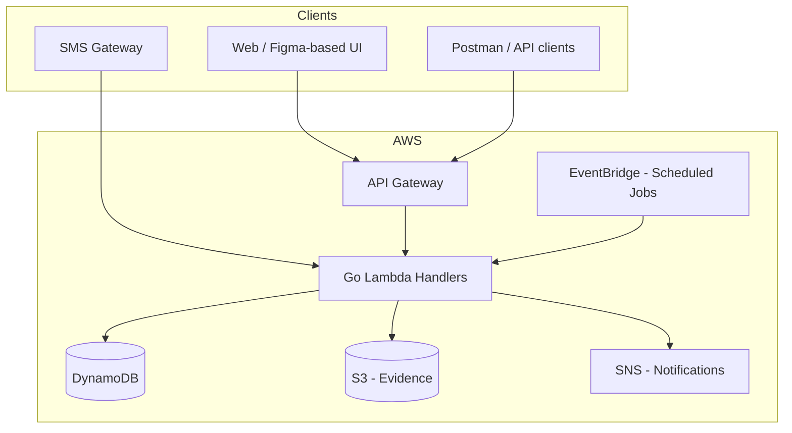

# ResQ � Project Plan

Disaster Alert & Resource Coordination System

Based on [ResQ_PRD.pdf](./ResQ_PRD.pdf)

---

## 1. Vision & Success Criteria

**What we're building:** A district-level coordination system for floods, landslides, fires, and emergencies � connecting citizens, responders, relief camps, and district admins.

**Success looks like:**

- Citizens can report incidents (web API + SMS fallback)
- District admins see and assign incidents in near real time
- Resources (vehicles, supplies, camps) are tracked and assignable
- Unresolved incidents auto-escalate after 30 minutes
- Severity-5 incidents trigger emergency broadcasts
- Evidence (photos/docs) can be attached to incidents
- Entire stack runs on AWS free tier where possible

---

## 2. User Roles & Permissions

| Role | Primary Actions |
|------|-----------------|
| **Citizen** | Report incidents, upload evidence, view own reports |
| **Responder** | View assigned incidents, update status, resolve with notes |
| **District Admin** | View all district incidents, assign responders/resources, escalate manually |
| **Relief Camp Coordinator** | Register camp capacity, update availability, receive assignments |

**Auth model:** JWT-based; role + `districtID` scoped on every request.

---

## 3. Architecture (Serverless)



**Design principles:** Stateless handlers, high availability, horizontally scalable via Lambda.

---

## 4. Data Model (DynamoDB)

### Tables

| Table | Partition Key | Sort Key | Key Attributes |
|-------|---------------|----------|----------------|
| **Users** | `userID` | � | `role`, `districtID`, `contact`, `passwordHash` |
| **Incidents** | `districtID` | `incidentID` | `timestamp`, `reporterID`, `severity` (1�5), `location`, `status`, `assignedTo`, `evidenceKeys[]` |
| **Resources** | `districtID` | `resourceID` | `type`, `capacity`, `availability`, `coordinatorID` |

### Status Enums

- **Incident:** `open` ? `assigned` ? `in_progress` ? `resolved` | `escalated`
- **Resource:** `available` | `assigned` | `depleted` | `offline`

### Recommended GSIs

- `incidents-by-status`: PK `districtID`, SK `status#timestamp` � for admin dashboards and escalation scans
- `incidents-by-severity`: PK `districtID`, SK `severity#timestamp` � for severity-5 broadcasts

---

## 5. API Surface

| Method | Endpoint | Role(s) | Purpose |
|--------|----------|---------|---------|
| `POST` | `/auth/register` | Public | Register user with role + district |
| `POST` | `/auth/login` | Public | Return JWT |
| `POST` | `/incident/report` | Citizen+ | Create incident |
| `GET` | `/incident/{district}` | Admin, Responder | List district incidents |
| `PATCH` | `/incident/{id}/assign` | Admin | Assign responder/resource |
| `PATCH` | `/incident/{id}/resolve` | Responder, Admin | Close incident |
| `POST` | `/resource/register` | Camp Coordinator, Admin | Register resource |
| `GET` | `/resource/{district}` | Admin, Coordinator | List district resources |
| `PATCH` | `/resource/{id}/status` | Coordinator, Admin | Update availability |

### Additional Endpoints (needed beyond PRD)

| Method | Endpoint | Purpose |
|--------|----------|---------|
| `POST` | `/incident/{id}/evidence` | Presigned S3 upload URL |
| `GET` | `/incident/{id}` | Single incident detail |
| `POST` | `/notifications/test` | Dev-only SNS test |

---

## 6. Event-Driven Features

| Feature | Trigger | Action |
|---------|---------|--------|
| **Auto-escalation** | EventBridge every 5 min | Find `open`/`assigned` incidents older than 30 min ? set `escalated`, notify district admin via SNS |
| **Severity-5 broadcast** | Incident create (severity=5) | Immediate SNS broadcast to district responders + admins |
| **SMS ingestion** | SNS ? Lambda or API Gateway webhook | Parse SMS ? create incident with `reporterID` from phone |
| **Monitoring job** | EventBridge daily | Aggregate open incidents, resource utilization per district |

---

## 7. Tech Stack

| Layer | Choice |
|-------|--------|
| Language | **Go** (Lambda handlers) |
| Compute | **AWS Lambda** |
| API | **API Gateway** (REST) |
| Database | **DynamoDB** (free tier) |
| Storage | **S3** (evidence) |
| Notifications | **SNS** (+ SMS via SNS) |
| Scheduling | **EventBridge** |
| CI/CD | **GitHub Actions** |
| API testing | **Postman** collection |
| UI | **Figma community templates** (emergency dashboard / admin panel) � adapt, don't build from scratch |

---

## 8. Implementation Phases

### Phase 0 � Foundation (Week 1)

- [ ] Initialize Go monorepo / module structure
- [ ] AWS account setup, IAM roles, local dev with SAM or Serverless Framework
- [ ] DynamoDB table definitions (IaC: SAM/CDK/Terraform)
- [ ] Shared packages: `auth`, `models`, `ddb`, `middleware`
- [ ] JWT auth middleware (register/login)
- [ ] GitHub Actions: lint, test, deploy to dev

### Phase 1 � Core CRUD (Week 2)

- [ ] Incident report + list by district
- [ ] Resource register + list + status update
- [ ] Role-based access control on all routes
- [ ] Postman collection for all endpoints
- [ ] Unit tests for handlers and auth

### Phase 2 � Workflows (Week 3)

- [ ] Assign incident (`PATCH /incident/{id}/assign`)
- [ ] Resolve incident (`PATCH /incident/{id}/resolve`)
- [ ] Evidence upload flow (S3 presigned URLs)
- [ ] Status transition validation (no invalid state jumps)

### Phase 3 � Event-Driven (Week 4)

- [ ] EventBridge rule: 30-minute escalation job
- [ ] Severity-5 broadcast on incident create
- [ ] SNS notification templates (email/SMS)
- [ ] SMS ingestion pipeline (webhook Lambda)
- [ ] Daily monitoring/aggregation job

### Phase 4 � UI & Integration (Week 5)

- [ ] Select and adapt Figma template (district admin dashboard)
- [ ] Wire UI to API (auth, incident list, assign, resolve)
- [ ] Citizen report form (minimal)
- [ ] End-to-end smoke tests

### Phase 5 � Hardening & Launch (Week 6)

- [ ] Security review (JWT expiry, input validation, district scoping)
- [ ] Error handling + structured logging (CloudWatch)
- [ ] Load smoke test on free tier limits
- [ ] README, architecture diagram, deployment guide
- [ ] Resume-ready project summary

---

## 9. Repository Structure

```
disaster-management/
??? cmd/
?   ??? api/              # API Lambda entrypoints
?   ??? escalation/       # Scheduled escalation job
?   ??? sms-ingest/       # SMS webhook handler
??? internal/
?   ??? auth/
?   ??? incident/
?   ??? resource/
?   ??? notification/
?   ??? storage/
??? infra/                # SAM/CDK templates
??? postman/              # API collection
??? .github/workflows/    # CI/CD
??? docs/
    ??? architecture.md
    ??? api.md
```

---

## 10. Non-Functional Requirements

| Requirement | Approach |
|-------------|----------|
| High availability | Multi-AZ DynamoDB, Lambda across AZs |
| Stateless | No in-memory session; JWT only |
| Security | bcrypt passwords, JWT with short TTL + refresh, district isolation |
| Scalability | Per-route Lambda concurrency; DynamoDB on-demand billing |
| Cost | Stay within AWS free tier; monitor with Cost Explorer |

---

## 11. Risks & Mitigations

| Risk | Mitigation |
|------|------------|
| SMS provider cost/complexity | Start with SNS sandbox; mock SMS in dev |
| DynamoDB hot partitions | Partition by `districtID`; avoid global scans |
| Escalation false positives | Use `updatedAt` not just `createdAt`; exclude `in_progress` |
| Free tier limits | Set Lambda memory low, aggressive TTL on dev tables |
| UI scope creep | Strictly use Figma template; no custom design system |

---

## 12. Definition of Done (MVP)

The MVP is complete when:

1. All PRD API endpoints work with JWT auth and district scoping
2. Auto-escalation fires after 30 minutes on unresolved incidents
3. Severity-5 incidents trigger SNS broadcast
4. Evidence uploads to S3 and links attach to incidents
5. SMS ingestion creates incidents (even if mocked in dev)
6. Postman collection documents full API
7. GitHub Actions deploys to AWS on merge to `main`
8. Adapted Figma UI connects to live API for admin + citizen flows

---

## 13. Immediate Next Steps

1. Scaffold the Go + SAM/CDK project in this repo
2. Define DynamoDB tables in IaC
3. Implement auth (`register` / `login`) as the first vertical slice
4. Add Postman collection alongside each endpoint as it's built
